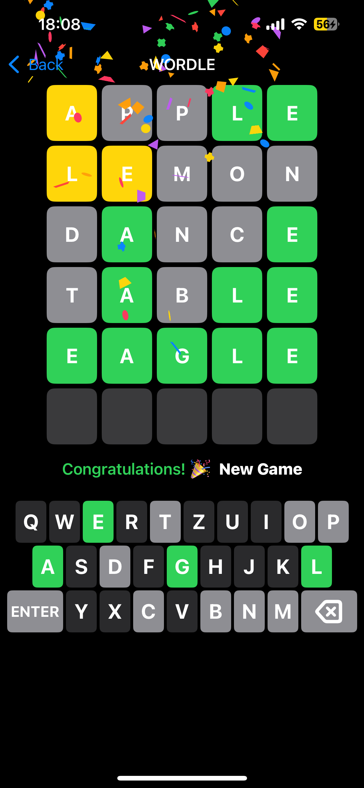
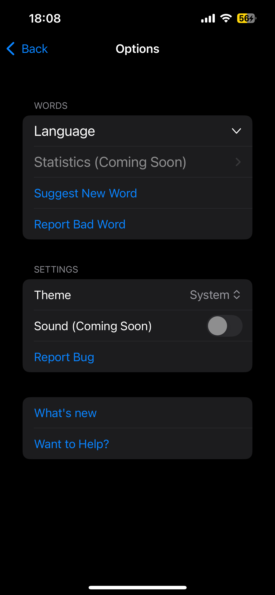

# 🎮 Wordle Classic! – Official Support Page

Welcome to the support and info page for **Wordle Classic!**, the fun, minimalist word-guessing game inspired by the original Wordle – now with support for both **Czech 🇨🇿** and **English 🇬🇧**.

---

## 🧩 What is Wordle Classic?

Wordle Classic is a clean and relaxing word game where your goal is to guess a hidden word within a limited number of attempts.

### 🔹 Features:
- 📝 5-letter mode  
- 🌐 English and Czech word support  
- ☀️ Dark & Light Mode support  
- 🧠 Challenging but casual design  
- 📤 Suggest your own words

### ScreenShots

  
  
  

---

## 🛠️ Roadmap (Coming Soon)
- Game Center support (achievements, scores)
- iPadOS, Android  
- Daily challenge mode  
- Leaderboards  
- Themes & customization

---

## ✍️ Suggest a Word / Report a Bug

Got a word you want added? Found a word that shouldn’t be there?  
We’d love to hear from you!

**🗨️ Feedback options:**
- Open an issue here on GitHub: [Create an Issue](https://krystofslama.github.io/wordle-support/issues.html)

---

## 📱 App Info

- **App Name:** Wordle Classic!  
- **Platform:** iOS  
- **Version:** 1.0  
- **Available on the App Store:** _Coming soon_

---

Thanks for playing, and keep guessing! 🎉  
